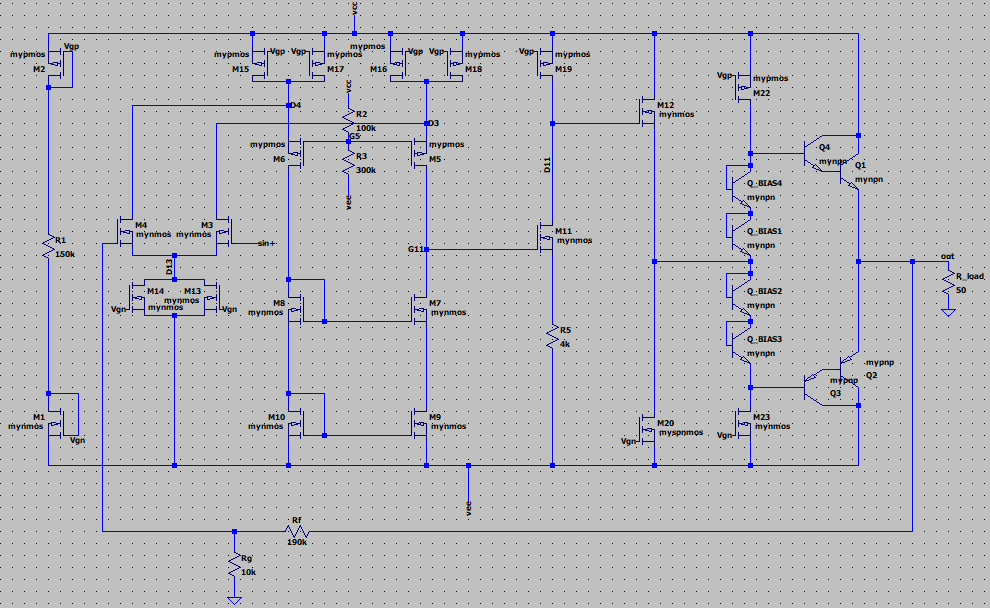
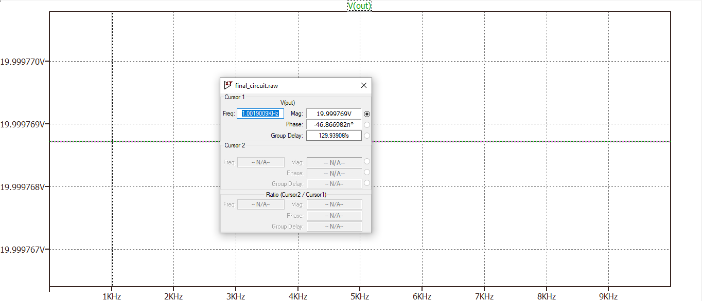
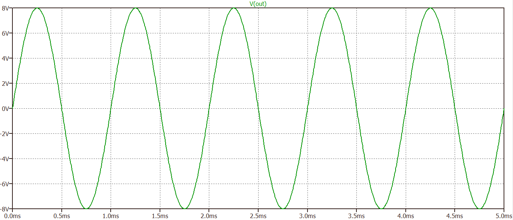
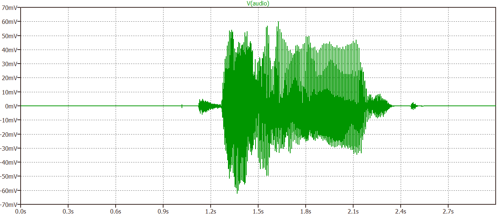
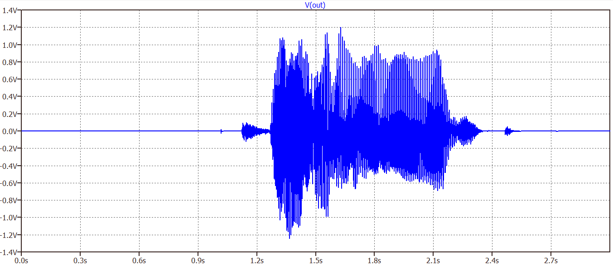

# Electronics-2-Amplifier

An analog amplifier design project completed for the **Electronics II (EE 25-032)** course at EE department, Sharif University of Technology.

## Overview

The project involves the design and LTspice simulation of an amplifier system, progressing from a high-gain open-loop amplifier to a closed-loop amplifier capable of driving a low-impedance load.

### Phase 1 — High-Gain Open-Loop Amplifier

Designed a high-gain amplifier using a MOSFET folded-cascode differential input stage, cascoded current-mirror load, source-degenerated common-source gain stage, and output buffer.

The design targets high differential gain, high common-mode rejection ratio (CMRR), and a wide output swing, with a specified input signal and load.

### Phase 2 — Closed-Loop Amplifier

Extended the design with a complementary BJT push-pull output stage using Darlington pairs, diode-connected transistor biasing, and global negative feedback.

The feedback network uses $R_g = 10\,\text{k}\Omega$ and $R_f = 190\,\text{k}\Omega$, corresponding to a nominal closed-loop gain of approximately 20 V/V.

## Tools and Technologies

* **LTspice** — Circuit design and AC/transient simulation.

## Results

The project includes circuit schematics, AC response, transient response, and audio waveform simulations.

The Phase 2 design targets a 50 Ω load. Its nominal closed-loop gain is approximately 20 V/V based on the feedback network.

All reported results are based on LTspice simulations, not physical hardware measurements. Refer to the corresponding phase reports for detailed performance results and comparisons against the project specifications.

### Circuit Schematic

The circuit schematic is provided as an LTspice circuit image:



### Simulation Results

The plots below are results from LTspice simulations:

**AC response**

The AC analysis plot shows approximately 1 V AC at the input and 20 V AC at the output, corresponding to an approximate voltage gain of **20 V/V** under the displayed plot conditions.



**Transient response**

The transient waveform shows a 50 mV input and an output amplitude of approximately 8 V.



### Audio Demonstration

The following two waveforms are transient-simulation waveforms for the input audio and output audio:





Audio files:

- [Input audio](audio/audio_input.png)
- [Output audio](audio/audio_output.png)

## Repository Structure

```text
Electronics-2-Amplifier/
├── README.md
├── simulation/
│   ├── phase1_differential_amplifier.asc
│   └── phase2_closed_loop_amplifier.asc
├── reports/
│   ├── phase1_report.pdf
│   └── phase2_report.pdf
├── audio/
│   ├── audio_input.wav
│   └── audio_output.wav
└── assets/
    ├── schematic_overview.png
    ├── ac_response.png
    ├── transient_response.png
    ├── audio_waveform_1.png
    └── audio_waveform_2.png
```

## Reports

* [Phase 1 Report](reports/phase1_report.pdf) — Design, analysis, and results for the high-gain open-loop amplifier.
* [Phase 2 Report](reports/phase2_report.pdf) — Design, analysis, and results for the closed-loop amplifier and output stage.

## Notes

* Phase 1 open-loop specifications and Phase 2 closed-loop results represent different design objectives and should not be directly conflated.
* Reported gain and component values are based on circuit design and simulation, not hardware measurements.
* Consult each phase report for detailed specifications, performance metrics, and simulation results.

## Credits

|  Student Name  |        School      |
| :------------- | :----------------- |
| Parsa Paktinat | EE Department, Sharif University of Technology |
